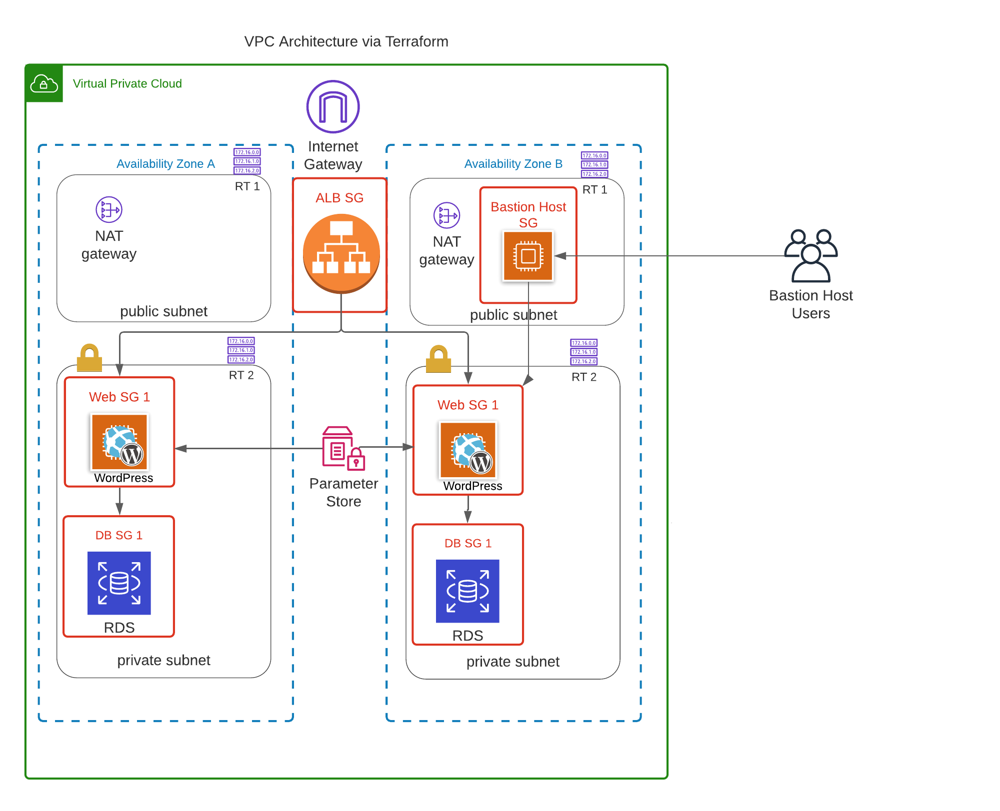

# Highly available Terraform Wordpress deployment
A Terraform solution for deploying a WordPress blog over multiple Availability Zones in AWS to achieve high-availability, Industry best practices, including AWS networking and services.

The project pulls a backup of an existing WP blog from a GitHub repo and deploys it over a couple of private and protected instances, while storing data in a Multi-AZ RDS DB Instance.

Wordpress is served on the instance using Apache, and its loads are distributed via an ALB which is publicly accessible.

DB Credentials are stored within SSM Parameter store and are pulled to and used on the instances using a bash script which runs on each boot.

## Demo



## Deployment 
To deploy this project run
```bash
  terraform init
  terraform plan
  terraform apply -var-db_username="<insert-requested-username>" -var-db_password="<insert-strong-password>" --auto-approve

```
