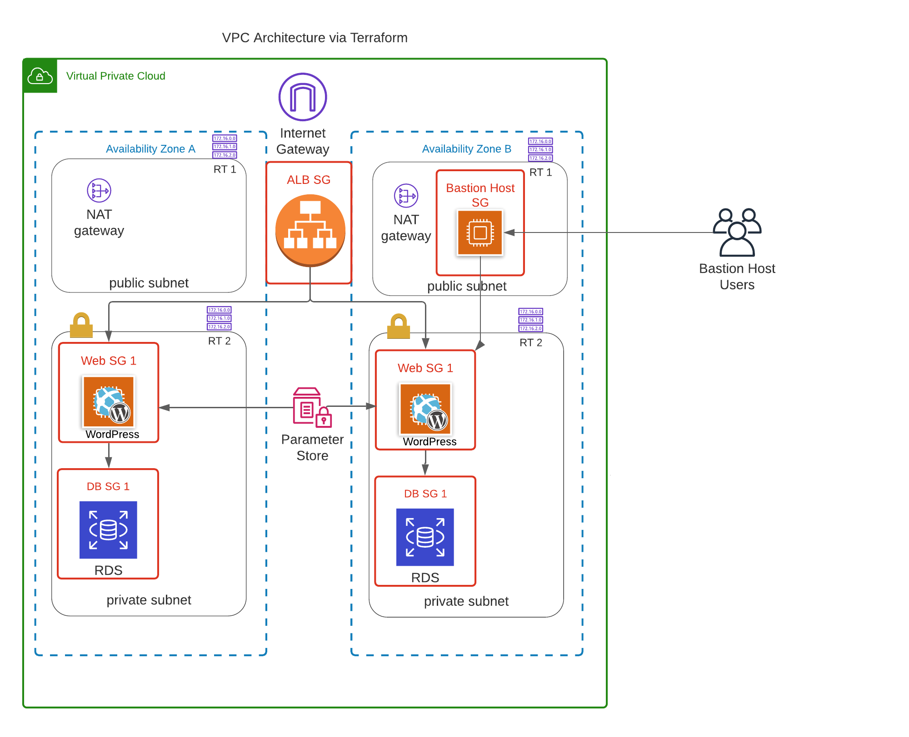

# Highly available Terraform Wordpress deployment
## This is the CI/CD embedded Version of the project.
A Terraform solution for deploying a WordPress blog over multiple Availability Zones in AWS to achieve high-availability, Industry best practices, including AWS networking and services.

The project pulls a backup of an existing WP blog from a GitHub repo and deploys it over a couple of private and protected instances, while storing data in a Multi-AZ RDS DB Instance.

Wordpress is served on the instance using Docker, While the Docker Image is pulled from ECR, Traffic is distributed via an ALB which is publicly accessible.

## Demo



## Deployment 
To deploy this project create an AWS CodePipeline with CodeBuild and CodeDeploy Stages
- Create a private S3 bucket for Terraform's state management
- Create an attach a Policy that Allows CodeBuild access to the S3 bucket
- Create the required CodeBuild Environment variables and Secrets Manager:
```bash
  # TF Remote Backend State Management:
  [TF_BACKEND_BUCKET="YOUR_TF_STATE_MANAGEMENT_S3_BUCKET", TF_BACKEND_REGION="S3_BUCKET_REGION", TF_BACKEND_KEY="terraform.tfstate"]
  # Optional DockerHub Credentials for avoiding DockerHub's throttling 
  [DOCKERHUB_USERNAME="(*Optional*)YOUR_DOCKERHUB_USERNAME" ,DOCKERHUB_PASSWORD="(*Optional*)YOUR_DOCKERHUB_PASSWORD"] 
  # App Required ENV Variables:
  [SECONDARY_REPO_URL="WP_CONTENT REPO TO PULL FROM", DB_USER="YOUR_SELECTED_DB_USER", DB_PASSWORD="YOUR_SELECTED_DB_PASSWORD", DB_ROOT_PASSWORD="YOUR_SELECTED_DB_ROOT_PASSWORD"]
```
